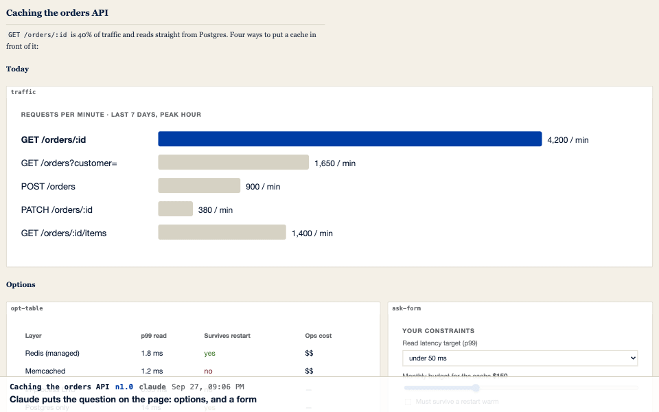
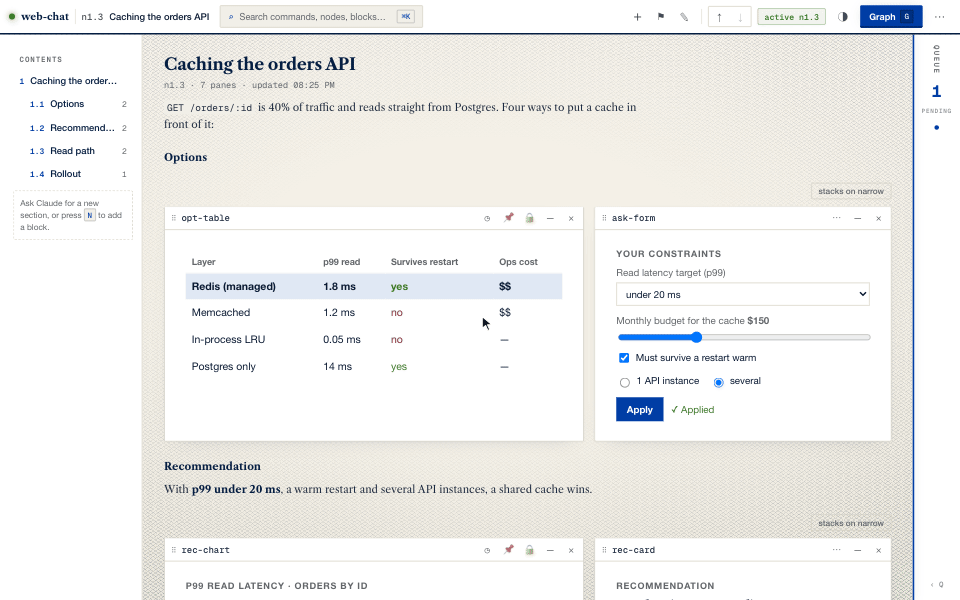
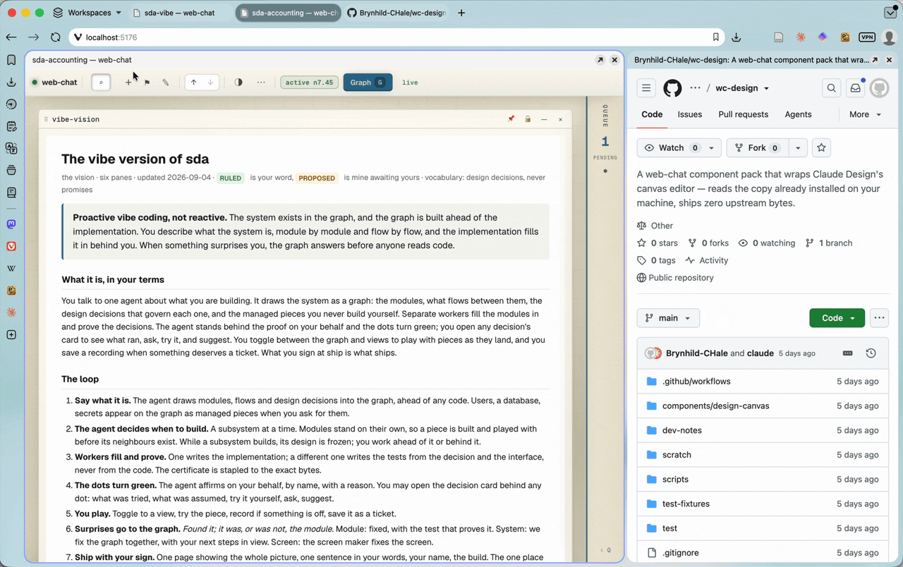

# claude-web-chat

A live page in your browser that Claude Code draws on while you talk in the terminal. Diagrams, forms, comparisons, and working mockups land on the page and stay interactive, with short headings and prose between them so a page reads top to bottom. What you click and type there flows back to Claude as data, and every turn becomes a node in a graph you can walk back through and branch.



## Quickstart

You'll need **Node 22+** and **Claude Code**, on **macOS or Linux** (on Windows, use WSL2 — see [platform support](docs/platform-support.md)).

**1. Install.** No npm, no sudo. The release is checksum-verified and unpacked under `~/.web-chat/`, with the command linked into `~/.local/bin`:

```sh
curl -fsSL https://raw.githubusercontent.com/Brynhild-CHale/claude-web-chat/main/install.sh | sh
```

**2. Set up a project.** web-chat is opt-in per project. `init` lists what it will write, asks once, and installs:

```sh
cd ~/Dev/my-project
claude-web-chat init
```

**3. Restart Claude Code** in that project, and approve the new `web-chat` MCP server when it asks.

**4. Open the surface:**

```sh
claude-web-chat open
```

**5. Start.** In Claude Code, type `/web-chat` for a guided first pane, or just ask:

> Sketch this project's architecture as a diagram on the surface.

## Pages

A page is a sequence of panes and short markdown. Claude writes a `#` title and `##` headings between runs of panes, and the headings become the page's **Contents** column. Panes sit on a 12-column grid: drag one by its header or resize it, and **↺ Claude's layout** puts a run back. What you type in a pane is kept across refreshes and turns. Hit **Push → Claude** (`P`) to hand what you did back to Claude as data.

## History is a graph

Every turn that changes the surface is saved as a node. A turn that only answers in chat saves nothing, and is listed on the next node that does. Preview any earlier state (read-only), set it active on the graph screen, and your next message branches from there, so trying a different direction never loses the first one. A run of turns collapses into a ×N stack, and bookmarks name the moments that matter.


## Replay

Replay plays a stretch of history forward, node by node, with Claude's reply under each one. Press `R` on the page or **▶ Replay** in the graph inspector. Claude can also direct one: it picks the nodes, how long each one holds and a caption for each, then opens it in your browser (`export({script, open: true})`). Any replay exports as an offline `.html` player, a GIF, or (with ffmpeg) an MP4 or WebM. The page at the top of this README is one of those GIFs, rendered by web-chat.



## Looks

Three theme packs are built in, each with a light and a dark mode: **Georgetown Blue** (navy and blue on vellum, Caslon headings), where new projects start, **Earthy** (the original look) and **Paper** (flat cream). Switch with ⋯ → Settings, or `◑` / `T` for light and dark. A theme pack from someone else installs from its GitHub link the same way a component pack does, logos and fonts included. Settings → Brand puts your own logo in the topbar and on exported pages. See [Themes](docs/themes.md).

## Components

Claude saves panes worth keeping to the project's component library and reuses them. Component packs install a whole set at once, plus a skill that tells Claude when to use them. Install one from the topbar's **＋ → Manage**, or from the terminal:

```sh
claude-web-chat pack get https://github.com/acme/ops-pack    # download and review first; installs nothing
```



## Every project on this machine

⋯ → **Sessions** (`S`) lists every web-chat project on this computer: whether its surface is running, and whether a Claude Code session is attached or in the middle of a turn. Click one to open it. `claude-web-chat ls` prints the same list in the terminal.

## From your phone

`claude-web-chat tunnel` puts this machine's surfaces behind a Cloudflare tunnel, so you can open them from a phone or another computer. You sign in through Cloudflare Access, and only accounts you allowlisted get in. Nothing is reachable from outside until you run `tunnel setup` and `tunnel up`. On a phone, blocks stay interactive and the layout stays fixed. See [Remote access](docs/remote-access.md).

## Documentation

| | |
| --- | --- |
| [Using web-chat](docs/guide.md) | everyday use, service components and `trust`, packs, channels, the browser extension, the command line, security, troubleshooting |
| [Installing and updating](docs/install.md) | what `install.sh` and `init` do, updates and rollback, turning it off, what it writes to your machine |
| [Component packs](docs/component-packs.md) · [Service components](docs/service-components.md) | building and shipping your own components |
| [Channels](docs/channels-dev.md) · [Driving the surface](docs/driving-the-surface.md) · [Exporting pages](docs/export-pages.md) | the wake path, external processes, self-contained `.html` exports and replays |
| [Themes](docs/themes.md) | the builtin packs (Earthy, Paper, Georgetown Blue), light and dark modes, the design tokens, brand images |
| [Remote access](docs/remote-access.md) | `claude-web-chat tunnel`: your surfaces from a phone or another computer, behind Cloudflare Access |
| [Capture profiles](docs/capture-profiles-and-panes.md) | how the browser extension distils a captured page, and the pane it lands in |
| [Platform support](docs/platform-support.md) | macOS, Linux, and WSL2 |
| [Contributing](docs/extending.md) | development setup and architecture (also [`CLAUDE.md`](CLAUDE.md)); run the tests with `npm test` |

Every doc is also readable from the terminal with `claude-web-chat docs <name>`.

## License

[MIT](LICENSE). See [`CHANGELOG.md`](CHANGELOG.md) for what's landed.
